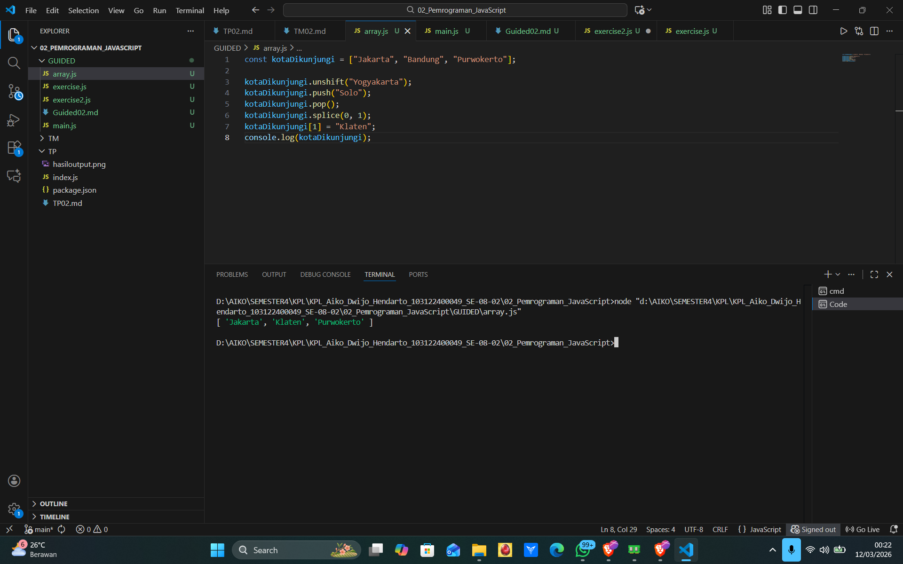
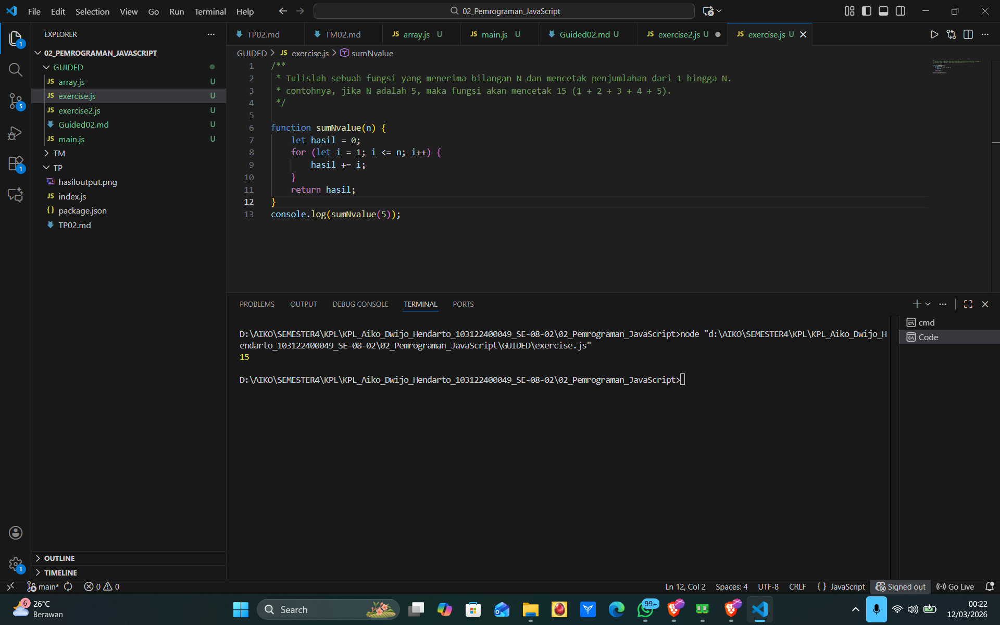
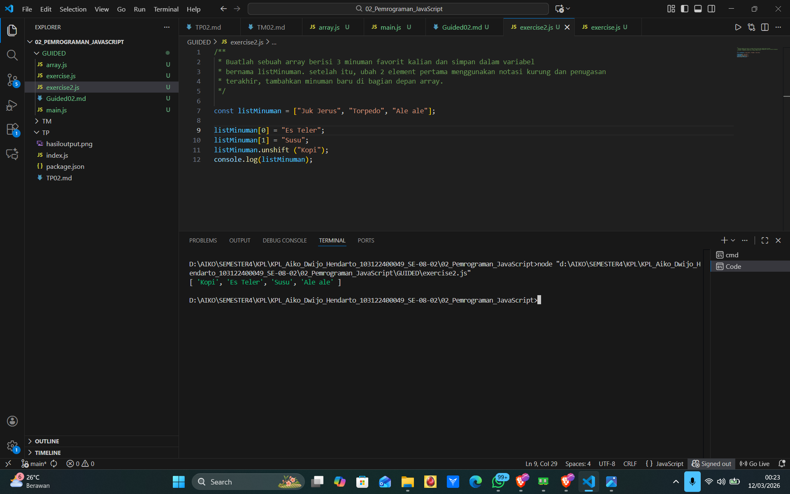
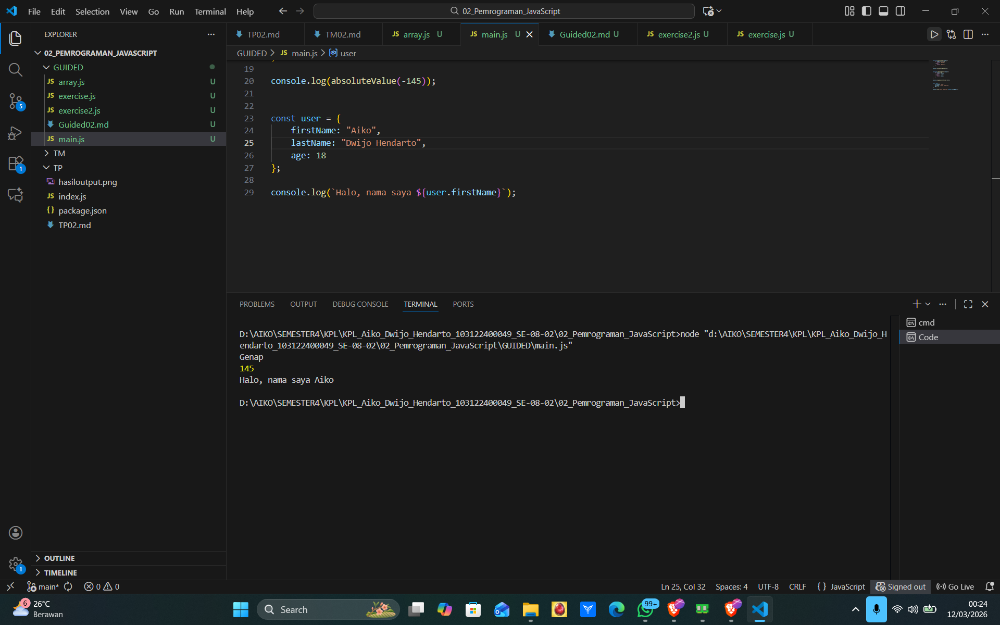

# Guided 02 - Pemrograman JavaScript

**Nama:** Aiko Dwijo Hendarto  
**NIM:** 103122400049  
**Kelas:** SE-08-02  

---

## array.js

Program membuat sebuah array bernama `kotaDikunjungi` yang berisi beberapa nama kota.

Beberapa operasi array yang digunakan:

- `unshift()` untuk menambahkan elemen di awal array
- `push()` untuk menambahkan elemen di akhir array
- `pop()` untuk menghapus elemen terakhir
- `splice()` untuk menghapus elemen pada posisi tertentu
- perubahan nilai menggunakan indeks array

Output program:

---

## exercise.js

Pada file ini dibuat fungsi `sumNvalue(n)` yang berfungsi menghitung jumlah bilangan dari 1 sampai dengan nilai `n`.

Program menggunakan perulangan `for` untuk menjumlahkan setiap angka ke dalam variabel `hasil`. Setelah perulangan selesai, nilai tersebut dikembalikan menggunakan `return`.

Fungsi kemudian dipanggil dengan nilai `5` sehingga program menghitung:

Hasilnya adalah `15`.

Output program:

---

## exercise2.js

Program membuat sebuah array bernama `listMinuman` yang berisi tiga minuman.

Kemudian dua elemen pertama diubah menggunakan notasi indeks. Setelah itu program menambahkan satu minuman baru di bagian awal array menggunakan fungsi `unshift()`.

Terakhir, isi array ditampilkan menggunakan `console.log()`.

Output program:

---

## main.js

File ini berisi contoh penggunaan fungsi sederhana dan object pada JavaScript.

Program membuat dua fungsi:
- `ganjilGenap()` untuk menentukan apakah sebuah angka genap atau ganjil
- `absoluteValue()` untuk mengubah angka negatif menjadi nilai positif

Selain itu dibuat sebuah object bernama `user` yang menyimpan data seperti `firstName`, `lastName`, dan `age`.

Program kemudian mengambil nilai `firstName` dari object tersebut dan menampilkannya menggunakan `console.log()`.

Output program:

