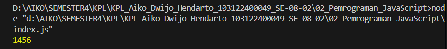

# TP02 - Pemrograman JavaScript

**Nama:** Aiko Dwijo Hendarto  
**NIM:** 103122400049  
**Kelas:** SE-08-02  

**Dosen Pengampu:** Yudha Islami Sulistiya  
**Asisten Praktikum:** Adhiansyah Ancha & Hamid Khaeruman

---

## Soal

Membuat program JavaScript yang dijalankan melalui Node.js untuk melakukan operasi pada sebuah array dengan memanfaatkan konsep dasar pemrograman seperti variabel, percabangan, perulangan, dan fungsi.

---

## Kode Sumber

Kode utama program terdapat pada file berikut:

- [index.js](index.js)

Konfigurasi project Node.js terdapat pada:

- [package.json](package.json)

---

## Output Program

Program dijalankan menggunakan terminal dengan Node.js.

Contoh hasil program dapat dilihat pada gambar berikut:



---

## Penjelasan

Program ini dibuat menggunakan JavaScript yang dijalankan melalui runtime **Node.js**. Program bertujuan untuk menghitung hasil perkalian dari nilai yang ada di dalam sebuah array dengan kondisi tertentu.

Array yang digunakan pada program adalah:

```javascript
const arr1 = [2, 26, 28, -2];