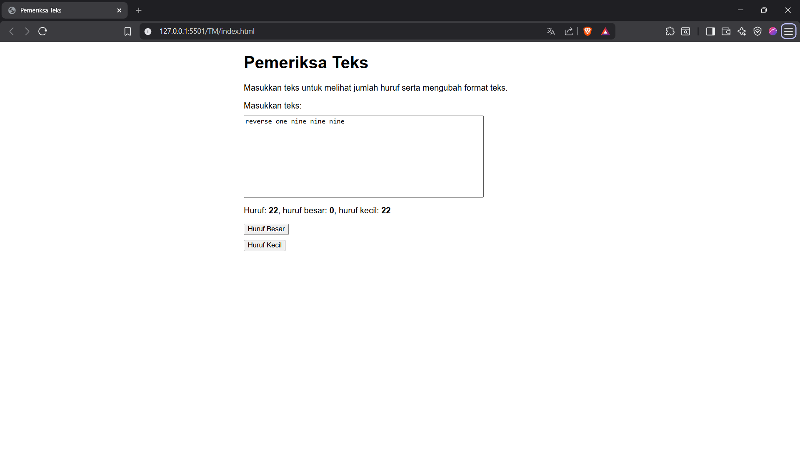
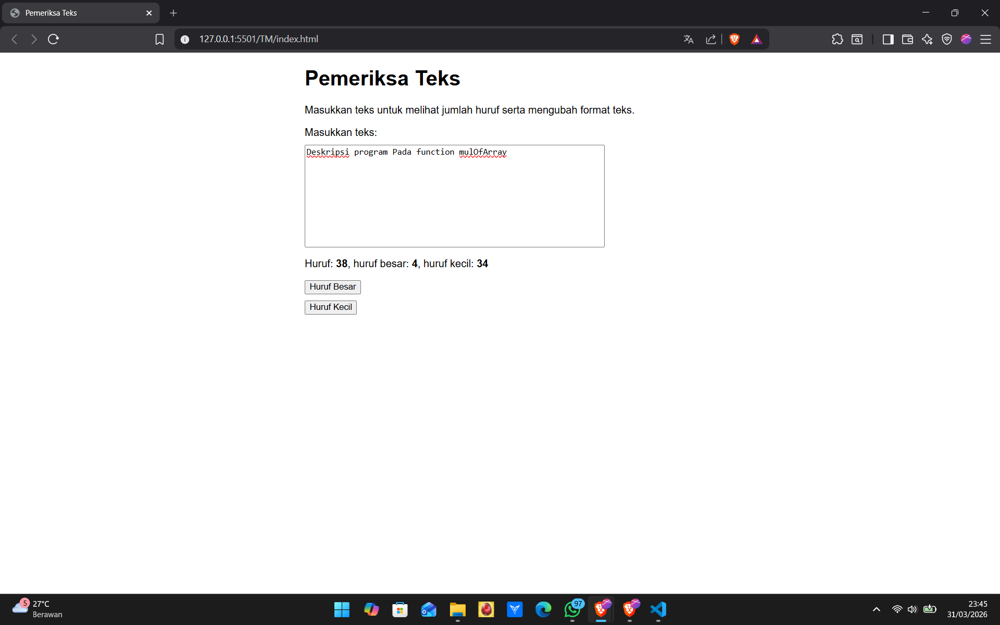
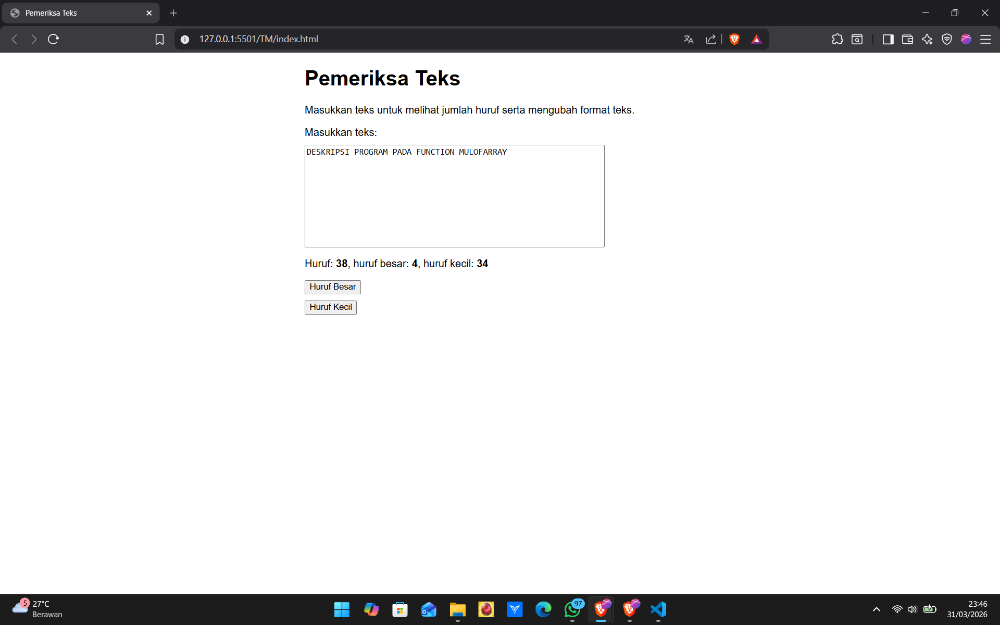
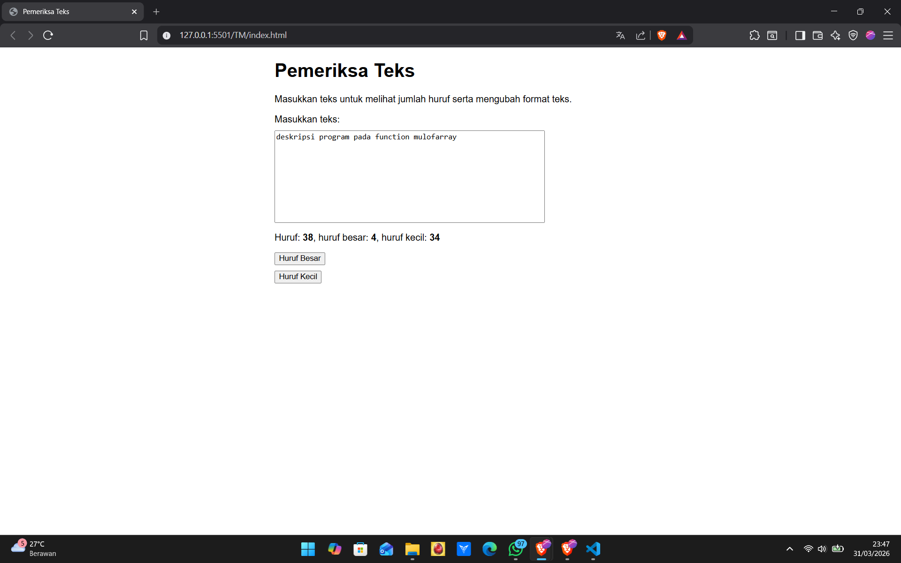

# TM03 - GUI dengan HTML dan CSS

Nama: Aiko Dwijo Hendarto  
NIM: 103122400049  
Kelas: SE-08-02  

Dosen Pengampu: Yudha Islami Sulistiya  
Asisten Praktikum: Adhiansyah Ancha & Hamid Khaeruman  

---

## Soal

Setelah menyelesaikan tugas pendahuluan, lakukan pengembangan pada program dengan:

1. Menghitung jumlah huruf kecil dan menampilkannya pada bagian **#hk**  
2. Mengubah semua huruf kecil menjadi huruf besar saat tombol **#huruf-besar** ditekan  
3. Mengubah semua huruf besar menjadi huruf kecil saat tombol **#huruf-kecil** ditekan  

Hasil dari perubahan teks ditampilkan kembali pada **editor-kecil**.  
Fitur **Paragrafkan** dihapus dari program.

---

## Kode Sumber

File HTML terdapat pada:  
[index.html](./index.html)

Logika JavaScript terdapat pada:  
[index.js](./index.js)

Tampilan menggunakan CSS terdapat pada:  
[index.css](./index.css)

---

## Output Program

### TM1

### TM2

### TM3

### TM4

---

## Deskripsi

Program ini merupakan pengembangan dari tugas sebelumnya dengan menambahkan fitur pengolahan teks yang lebih spesifik.

Perubahan utama yang dilakukan adalah penambahan fungsi untuk menghitung jumlah huruf kecil dari teks yang dimasukkan pengguna. Perhitungan dilakukan dengan memeriksa setiap karakter dan hanya menghitung karakter dalam rentang **a–z**, kemudian hasilnya ditampilkan pada bagian **#hk**.

Selain itu, ditambahkan dua tombol untuk manipulasi teks:
- Tombol **huruf besar** digunakan untuk mengubah seluruh teks menjadi huruf kapital menggunakan fungsi bawaan JavaScript.
- Tombol **huruf kecil** digunakan untuk mengubah seluruh teks menjadi huruf kecil.

Setiap perubahan langsung ditampilkan kembali pada textarea sehingga pengguna dapat melihat hasilnya secara langsung.

Fitur **Paragrafkan** yang sebelumnya ada telah dihapus, sehingga program hanya berfokus pada:
- perhitungan huruf
- konversi huruf besar dan kecil

Dengan perubahan ini, program menjadi lebih sederhana dan sesuai dengan kebutuhan tugas.