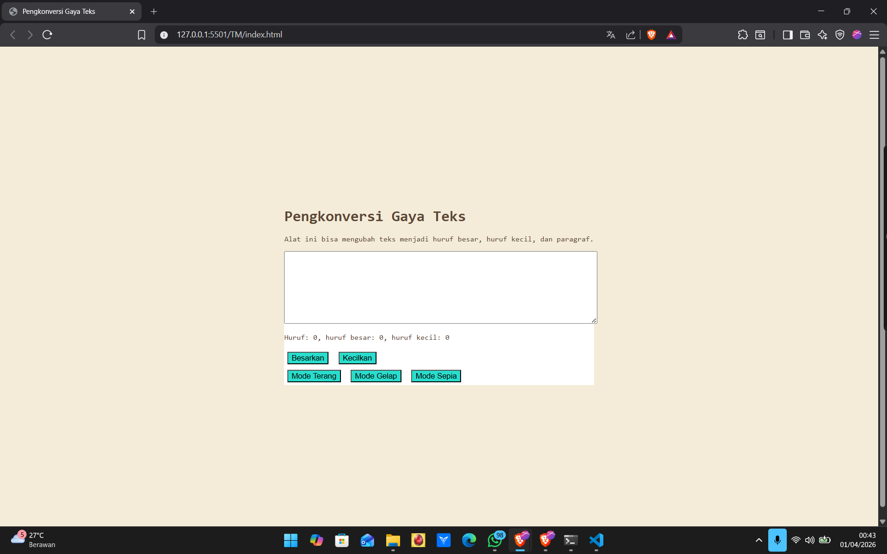

# Modul 4 – Automata dan Table-Driven Construction

## 4.5 Tugas Mandiri

### Deskripsi

Pada tugas mandiri ini dilakukan pengembangan dari tugas sebelumnya dengan menambahkan **mode sepia**. Sistem kini memiliki tiga state utama yaitu:

* `light-mode`
* `dark-mode`
* `sepia-mode`

State digunakan untuk mengatur tampilan aplikasi tanpa menambah kompleksitas logika pada program.

---

## Konsep yang Digunakan

### 1. Automata (State & Transition)

Program dipandang sebagai sistem state.

* State:

  * Light
  * Dark
  * Sepia
* Transition:

  * Klik tombol → berpindah state

State disimpan pada elemen root:

```html
<html class="dark-mode">
```

---

### 2. Single Source of Truth

State hanya disimpan di satu tempat:

```
document.documentElement
```

Tidak menggunakan variabel tambahan untuk menyimpan mode.

---

### 3. State Switching

Untuk memastikan hanya satu state aktif, digunakan fungsi:

```javascript
function setMode(mode) {
  document.documentElement.classList.remove("light-mode");
  document.documentElement.classList.remove("dark-mode");
  document.documentElement.classList.remove("sepia-mode");

  document.documentElement.classList.add(mode);
}
```

Pendekatan ini memastikan:

* Tidak ada state yang bertumpuk
* Perpindahan state konsisten

---

### 4. State Scoping

Efek state dibatasi menggunakan selector CSS:

```css
.dark-mode .editor-kecil { ... }
.sepia-mode .editor-kecil { ... }
```

Artinya:

* State global → efek lokal
* Tidak semua elemen terpengaruh

---

### 5. Table-Driven Construction

Perubahan perilaku tidak menggunakan if-else, melainkan mapping melalui CSS:

| State      | Target       | Efek                      |
| ---------- | ------------ | ------------------------- |
| light-mode | halaman      | tampilan default          |
| dark-mode  | halaman      | background gelap          |
| sepia-mode | halaman      | warna sepia               |
| sepia-mode | editor-kecil | tetap putih (sesuai soal) |

---

## Implementasi

### HTML

```html
<div class="editor-kecil">
  <textarea id="editor"></textarea>

  <button id="huruf-besar">Besarkan</button>
  <button id="huruf-kecil">Kecilkan</button>

  <div class="mode-div">
    <button id="tombol-terang">Mode Terang</button>
    <button id="tombol-gelap">Mode Gelap</button>
    <button id="tombol-sepia">Mode Sepia</button>
  </div>
</div>
```

---

### CSS

```css
.light-mode {
  background-color: white;
  color: black;
}

.dark-mode {
  background-color: #171b25;
  color: #ebecf7;
}

.dark-mode .editor-kecil {
  background-color: #2e3443;
}

.sepia-mode {
  background-color: #F4ECD8;
  color: #5B4636;
}

.sepia-mode .editor-kecil {
  background-color: white;
}
```

---

### JavaScript

```javascript
function setMode(mode) {
  document.documentElement.classList.remove("light-mode");
  document.documentElement.classList.remove("dark-mode");
  document.documentElement.classList.remove("sepia-mode");

  document.documentElement.classList.add(mode);
}

btnTerang.onclick = () => setMode("light-mode");
btnGelap.onclick = () => setMode("dark-mode");
btnSepia.onclick = () => setMode("sepia-mode");
```

---


### Mode Sepia



---

## Hasil

* Tiga mode berhasil diimplementasikan
* Perpindahan state berjalan dengan benar
* Tidak ada state yang bertumpuk
* Editor tetap berwarna putih pada mode sepia sesuai ketentuan

---

## Kesimpulan

Implementasi ini menunjukkan:

* Program sebagai **state machine (automata)**
* State disimpan secara terpusat
* Perilaku ditentukan melalui **mapping (table-driven)** tanpa percabangan
* Sistem tetap sederhana namun sesuai konsep konstruksi perangkat lunak
