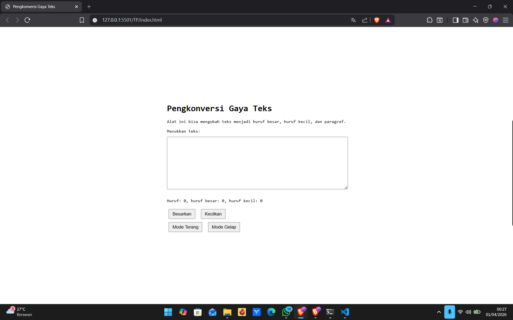
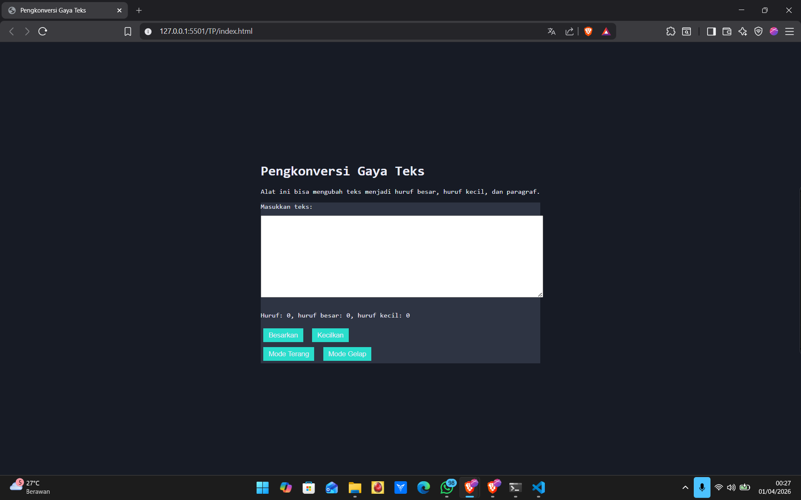

# Modul 4 – Automata dan Table-Driven Construction

## 4.4 Tugas Pendahuluan

### Deskripsi

Pada tugas ini dilakukan implementasi fitur **mode gelap** pada aplikasi Pengkonversi Gaya Teks. Fokus utama bukan hanya pada perubahan tampilan, tetapi pada penerapan konsep **state (automata)** dan **table-driven construction**.

State direpresentasikan secara global dan efeknya disebarkan ke komponen tertentu menggunakan CSS selector tanpa menambah kompleksitas logika pada JavaScript.

---

## Konsep yang Digunakan

### 1. Automata (State & Transition)

Program dipandang sebagai sistem dengan state.

* State: `mode-gelap`
* Transition:

  * Klik tombol gelap → masuk state
  * Klik tombol terang → keluar state

State disimpan pada elemen root:

```html
<html class="mode-gelap">
```

---

### 2. Single Source of Truth

State hanya disimpan di satu tempat:

```
document.documentElement
```

Tidak ada variabel tambahan seperti:

```
let mode = "gelap"
```

---

### 3. State Scoping

Efek state tidak diterapkan secara global ke semua elemen, tetapi dibatasi menggunakan selector:

```css
.mode-gelap .editor-kecil
```

Artinya:

* State global → efek hanya pada bagian tertentu
* Editor memiliki perilaku khusus dibanding elemen lain

---

### 4. Table-Driven Construction

Tidak menggunakan if-else untuk menentukan perilaku.

Sebagai gantinya:

* Mapping dilakukan melalui CSS selector

| State      | Target         | Efek                 |
| ---------- | -------------- | -------------------- |
| mode-gelap | body           | background gelap     |
| mode-gelap | .editor-kecil  | warna editor berubah |
| mode-gelap | button (dalam) | warna tombol berubah |

---

## Implementasi

### HTML

```html
<!DOCTYPE html>
<html lang="id">
<head>
    <meta charset="UTF-8">
    <title>Pengkonversi Gaya Teks</title>
    <link rel="stylesheet" href="index.css">
</head>
<body>

<div id="container">
    <h1>Pengkonversi Gaya Teks</h1>
    <p>Alat ini bisa mengubah teks menjadi huruf besar, huruf kecil, dan paragraf.</p>

    <div class="editor-kecil">
        <label>Masukkan teks:</label>
        <textarea class="kotak-input" id="editor"></textarea>

        <p>
            Huruf: <span id="hf">0</span>,
            huruf besar: <span id="hb">0</span>,
            huruf kecil: <span id="hk">0</span>
        </p>

        <div>
            <button id="huruf-besar">Besarkan</button>
            <button id="huruf-kecil">Kecilkan</button>
        </div>

        <div class="grup-tg">
            <button id="tombol-terang">Mode Terang</button>
            <button id="tombol-gelap">Mode Gelap</button>
        </div>
    </div>
</div>

<script src="index.js"></script>
</body>
</html>
```

---

### CSS

```css
body {
    display: flex;
    justify-content: center;
    align-items: center;
    min-height: 100vh;
    margin: 0;
    font-family: monospace;
}

#container {
    padding: 30px;
}

.kotak-input {
    width: 100%;
    margin: 10px 0;
}

button {
    margin: 5px;
    padding: 5px 10px;
    cursor: pointer;
}

/* STATE GLOBAL */
.mode-gelap {
    background-color: #171b25;
    color: #ebecf7;
}

/* STATE → SCOPE EDITOR */
.mode-gelap .editor-kecil {
    background-color: #2e3443;
}

/* STATE → SCOPE TOMBOL */
.mode-gelap .editor-kecil button {
    background-color: #29ddcc;
    color: inherit;
    border: none;
}
```

---

### JavaScript

```javascript
const editor = document.getElementById("editor");
const hf = document.getElementById("hf");
const hb = document.getElementById("hb");
const hk = document.getElementById("hk");

const btnBesar = document.getElementById("huruf-besar");
const btnKecil = document.getElementById("huruf-kecil");

const btnGelap = document.getElementById("tombol-gelap");
const btnTerang = document.getElementById("tombol-terang");

editor.addEventListener("input", (e) => {
    const text = e.target.value;

    hf.textContent = text.length;

    let besar = 0;
    let kecil = 0;

    for (let c of text) {
        if (c >= 'A' && c <= 'Z') besar++;
        if (c >= 'a' && c <= 'z') kecil++;
    }

    hb.textContent = besar;
    hk.textContent = kecil;
});

btnBesar.addEventListener("click", () => {
    editor.value = editor.value.toUpperCase();
});

btnKecil.addEventListener("click", () => {
    editor.value = editor.value.toLowerCase();
});

/* STATE TRANSITION */
btnGelap.addEventListener("click", () => {
    document.documentElement.classList.add("mode-gelap");
});

btnTerang.addEventListener("click", () => {
    document.documentElement.classList.remove("mode-gelap");
});
```

---

## Hasil

* Mode gelap aktif melalui satu state global
* Editor memiliki warna khusus sesuai spesifikasi
* Tombol dalam editor ikut berubah
* Tidak ada duplikasi state atau logika tambahan

---

## Output

### Mode Terang


### Mode Gelap



## Kesimpulan

Pendekatan ini menunjukkan:

* Program dipandang sebagai **state machine (automata)**
* State disimpan secara terpusat (**single source of truth**)
* Perilaku ditentukan melalui **mapping (table-driven)**, bukan percabangan
* CSS digunakan sebagai mekanisme distribusi state ke komponen

Struktur ini menghasilkan kode yang lebih terkontrol, konsisten, dan scalable.
