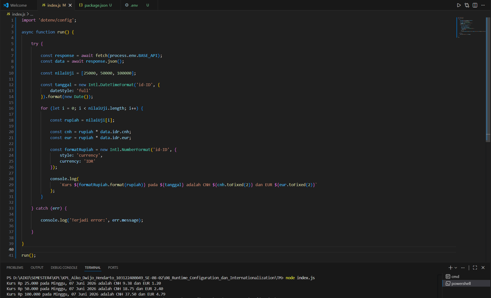

# Tugas Mandiri Modul 8

## Runtime Configuration dan Internationalization

### Identitas

* Nama: Aiko Dwijo Hendarto
* NIM: 103122400049
* Kelas: SE-08-02

---

## Deskripsi Program

Program dibuat menggunakan JavaScript dan Node.js untuk menampilkan konversi mata uang Rupiah (IDR) ke mata uang Renminbi China (CNH) dan Euro (EUR).

Program menggunakan:

* Runtime Configuration menggunakan `.env`
* API kurs mata uang
* Internationalization (`Intl`) untuk format tanggal dan mata uang

API yang digunakan:

```txt
https://cdn.jsdelivr.net/npm/@fawazahmed0/currency-api@latest/v1/currencies/idr.json
```

API tersebut digunakan untuk mengambil data nilai tukar mata uang terbaru secara realtime. Data yang diambil berupa kurs IDR terhadap berbagai mata uang dunia, termasuk CNH dan EUR.

---

## Struktur File

```txt
TM/
│
├── .env
├── index.js
├── package.json
└── tm8.png
```

Penjelasan:

* `.env` digunakan untuk menyimpan URL API.
* `index.js` berisi source code utama program.
* `package.json` digunakan untuk konfigurasi project Node.js.
* `tm8.png` merupakan screenshot hasil output program.

---

## Isi File `.env`

```env
BASE_API=https://cdn.jsdelivr.net/npm/@fawazahmed0/currency-api@latest/v1/currencies/idr.json
```

Penjelasan:

* Variabel `BASE_API` digunakan untuk menyimpan URL API agar lebih aman dan mudah diubah tanpa perlu mengedit source code utama.
* Penggunaan `.env` termasuk implementasi runtime configuration.

---

## Source Code `index.js`

Pada program ini digunakan `async function` untuk mengambil data API secara asynchronous menggunakan `fetch()`.

Program juga menggunakan:

* `try...catch` untuk menangani error.
* `Intl.DateTimeFormat` untuk format tanggal Indonesia.
* `Intl.NumberFormat` untuk format mata uang Rupiah.
* Array `nilaiUji` untuk melakukan pengujian beberapa nominal sekaligus.

Alur program:

1. Mengambil data kurs dari API.
2. Mengambil nilai kurs CNH dan EUR.
3. Menghitung konversi dari Rupiah ke CNH dan EUR.
4. Menampilkan hasil konversi ke terminal.

---

## Hasil Program

Berikut hasil output program:



Output:

```txt
Kurs Rp 25.000 pada Minggu, 07 Juni 2026 adalah CNH 9.38 dan EUR 1.20
Kurs Rp 50.000 pada Minggu, 07 Juni 2026 adalah CNH 18.75 dan EUR 2.40
Kurs Rp 100.000 pada Minggu, 07 Juni 2026 adalah CNH 37.50 dan EUR 4.79
```

Penjelasan:

* Program berhasil menghitung nilai tukar Rupiah ke CNH dan EUR.
* Nominal yang diuji adalah Rp25.000, Rp50.000, dan Rp100.000.
* Format tanggal sudah menggunakan lokal Indonesia.
* Format Rupiah sudah menggunakan format internationalization.

---

## Kesimpulan

Program berhasil:

* Mengambil data kurs dari API
* Menggunakan runtime configuration dengan `.env`
* Menggunakan fitur internationalization (`Intl`)
* Menampilkan format tanggal dan mata uang sesuai lokal
* Menggunakan error handling dengan `try...catch`

Dari tugas ini dapat dipahami bahwa runtime configuration memudahkan pengaturan aplikasi melalui file konfigurasi, sedangkan internationalization membantu aplikasi menampilkan format data sesuai bahasa dan wilayah tertentu.
