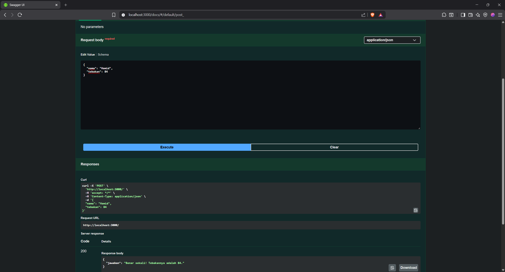

# Tugas Mandiri Modul 9

## API Design and Construction Using Swagger

### Identitas

* Nama: Aiko Dwijo Hendarto
* NIM: 103122400049
* Kelas: SE-08-02

---

# Deskripsi Program

Program dibuat menggunakan Node.js dan Express.js untuk membuat API permainan tebak angka sederhana. API menerima input berupa nama dan angka tebakan dari pengguna menggunakan metode `POST`.

Program akan menghasilkan angka tetap berdasarkan nama pengguna menggunakan perhitungan karakter ASCII. Angka tersebut kemudian dibandingkan dengan angka tebakan yang diberikan user.

Hasil yang ditampilkan berupa:

* Tebakan benar
* Tebakan terlalu tinggi
* Tebakan terlalu rendah

Selain itu, dokumentasi API dibuat menggunakan Swagger agar endpoint dapat diuji langsung melalui browser melalui halaman `/docs`.

---

# Penjelasan Tugas

Pada tugas ini dibuat sebuah API permainan tebak angka dengan satu endpoint utama yaitu `POST /`.

User mengirim data JSON berupa nama dan angka tebakan. Program kemudian menghasilkan angka otomatis berdasarkan nama menggunakan fungsi khusus.

Contoh request:

```json id="8shl0hz"
{
  "nama": "Hamid",
  "tebakan": 24
}
```

Setelah angka dibuat, sistem membandingkan angka tebakan dengan angka sebenarnya dan mengembalikan respon JSON sesuai hasil tebakan.

Angka yang dihasilkan akan selalu sama untuk nama yang sama, namun dapat berbeda untuk nama lain. Dokumentasi endpoint dibuat menggunakan Swagger agar API dapat diuji dan dilihat melalui browser.

---

# Struktur Folder

```txt id="xjlwmba"
TM/
│
├── node_modules
├── index.js
├── package.json
├── package-lock.json
├── swagger.js
├── TM1.png
├── TM2.png
└── TM3.png
```

---

# Source Code `index.js`

```js id="7b0f2b9"
const express = require('express');
const app = express();

const PORT = 3000;

app.use(express.json());

function generateNumber(nama) {

    let total = 0;

    for (let i = 0; i < nama.length; i++) {
        total += nama.charCodeAt(i);
    }

    return (total % 100) + 1;
}

/**
 * @swagger
 * /:
 *   post:
 *     summary: Tebak angka berdasarkan nama
 *     requestBody:
 *       required: true
 *       content:
 *         application/json:
 *           schema:
 *             type: object
 *             properties:
 *               nama:
 *                 type: string
 *               tebakan:
 *                 type: integer
 *     responses:
 *       200:
 *         description: Hasil tebakan
 */

app.post('/', (req, res) => {

    const { nama, tebakan } = req.body;

    const angkaBenar = generateNumber(nama);

    let jawaban = '';

    if (tebakan === angkaBenar) {

        jawaban = `Benar sekali! Tebakannya adalah ${angkaBenar}.`;

    } else if (tebakan > angkaBenar) {

        jawaban = 'Tebakanmu terlalu tinggi!';

    } else {

        jawaban = 'Tebakanmu terlalu rendah!';
    }

    res.json({
        jawaban
    });

});

const swaggerJSDoc = require('swagger-jsdoc');
const swaggerUi = require('swagger-ui-express');

const options = {
    definition: {
        openapi: '3.0.0',
        info: {
            title: 'Tebak Angka API',
            version: '1.0.0',
            description: 'API permainan tebak angka'
        }
    },
    apis: ['./index.js']
};

const specs = swaggerJSDoc(options);

app.use('/docs', swaggerUi.serve, swaggerUi.setup(specs));

app.listen(PORT, () => {
    console.log(`Server berjalan di http://localhost:${PORT}`);
});
```

---

# Output





---

# Kesimpulan

Program berhasil:

* Membuat API menggunakan Express.js
* Menggunakan endpoint `POST`
* Menerima input JSON dari user
* Menghasilkan angka tetap berdasarkan nama
* Membandingkan angka tebakan dengan angka sebenarnya
* Menampilkan hasil tebakan dalam format JSON
* Membuat dokumentasi API menggunakan Swagger
* Menjalankan dan menguji API melalui browser menggunakan `/docs`
