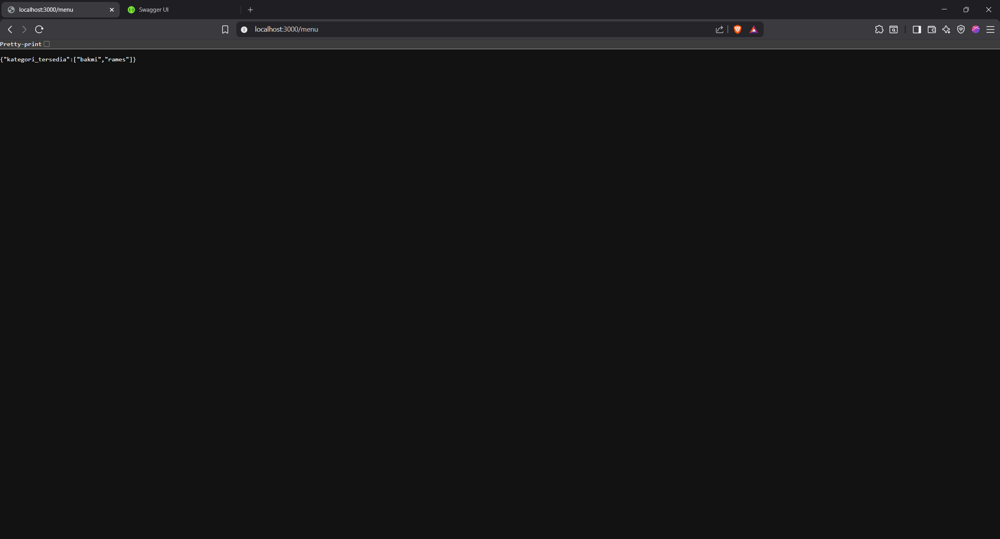
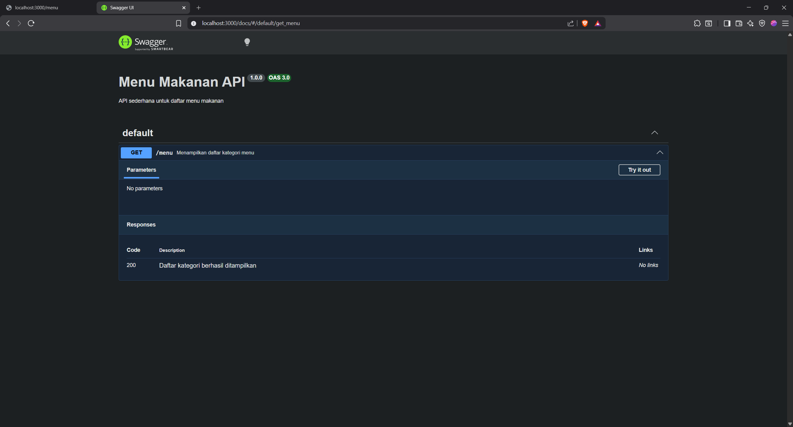

# Tugas Pendahuluan Modul 9
## API Design dan Construction Using Swagger

### Identitas
- Nama: Aiko Dwijo Hendarto
- NIM: 103122400049
- Kelas: SE-08-02

---

## Deskripsi Program

Program dibuat menggunakan Node.js dan Express.js untuk membuat API sederhana daftar kategori menu makanan.

Program juga menggunakan Swagger untuk mendokumentasikan API sehingga endpoint dapat dilihat dan diuji melalui browser.

Endpoint yang dibuat:
- `GET /menu`
- `GET /docs`

---

## Penjelasan Tugas

Pada tugas pendahuluan Modul 9 ini dilakukan pembuatan REST API sederhana menggunakan Express.js dan dokumentasi API menggunakan Swagger.

API dibuat untuk menampilkan daftar kategori menu makanan yang tersedia. Data menu disimpan dalam object JavaScript sederhana tanpa database.

Endpoint utama yang dibuat adalah:

```txt
GET /menu
```

Endpoint tersebut digunakan untuk menampilkan seluruh kategori menu yang tersedia dalam format JSON.

Selain membuat API, program juga menggunakan Swagger agar endpoint dapat terdokumentasi secara otomatis dan dapat diuji langsung melalui browser.

Dokumentasi Swagger dapat diakses melalui:

```txt
http://localhost:3000/docs
```

Pada halaman Swagger akan tampil informasi endpoint, method HTTP, response, serta deskripsi API.

Hasil akhir program:
- API berhasil berjalan pada Express.js
- Endpoint `/menu` berhasil menampilkan kategori menu
- Swagger berhasil menampilkan dokumentasi API
- Endpoint dapat diuji langsung melalui browser

---

## Library yang Digunakan

```bash
npm install express swagger-jsdoc swagger-ui-express
```

---

## Struktur File

```txt
TP/
│
├── index.js
├── swagger.js
├── package.json
├── TP1.png
└── TP2.png
```

---

## Source Code `swagger.js`

```js
const swaggerJSDoc = require('swagger-jsdoc');
const swaggerUi = require('swagger-ui-express');

const options = {
    definition: {
        openapi: '3.0.0',
        info: {
            title: 'Menu Makanan API',
            version: '1.0.0',
            description: 'API sederhana untuk daftar menu makanan'
        }
    },
    apis: ['./index.js']
};

const specs = swaggerJSDoc(options);

module.exports = {
    specs,
    swaggerUi
};
```

---

## Source Code `index.js`

```js
const express = require('express');
const app = express();

const PORT = 3000;

const { specs, swaggerUi } = require('./swagger');

const menuData = {
    bakmi: {
        "bakmi ayam spesial": 25000,
        "bakmi rica-rica": 28000,
        "bakmi komplit (bakso pangsit)": 35000
    },

    rames: {
        "nasi rames biasa": 15000,
        "nasi rames rendang": 25000,
        "nasi rames telur balado": 18000
    }
};

/**
 * @swagger
 * /menu:
 *   get:
 *     summary: Menampilkan daftar kategori menu
 *     responses:
 *       200:
 *         description: Daftar kategori berhasil ditampilkan
 */

app.get('/menu', (req, res) => {

    const kategori = Object.keys(menuData);

    res.json({
        kategori_tersedia: kategori
    });

});

app.use('/docs', swaggerUi.serve, swaggerUi.setup(specs));

app.listen(PORT, () => {
    console.log(`Server berjalan di http://localhost:${PORT}`);
});
```

---

## Hasil Endpoint `/menu`



Output:

```json
{
  "kategori_tersedia": [
    "bakmi",
    "rames"
  ]
}
```

---

## Hasil Swagger Documentation `/docs`



---

## Kesimpulan

Program berhasil:
- Membuat REST API sederhana menggunakan Express.js
- Membuat endpoint `GET /menu`
- Menampilkan daftar kategori menu dalam format JSON
- Menggunakan Swagger untuk dokumentasi API
- Menampilkan dokumentasi endpoint melalui `/docs`