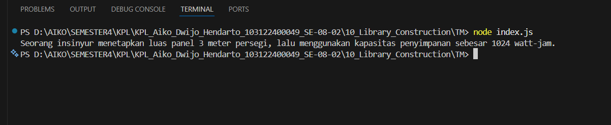

# Tugas Mandiri Modul 10

## Library Construction

### Identitas

* Nama : Aiko Dwijo Hendarto
* NIM : 103122400049
* Kelas : SE-08-02

---

# Deskripsi Program

Program ini dibuat untuk memenuhi tugas mandiri Modul 10 mengenai pembuatan pustaka (library) JavaScript yang rapi dan modular. Program memiliki tiga fungsi matematika yang dipisahkan ke dalam beberapa file berbeda di dalam folder `lib`.

Fungsi yang dibuat terdiri dari:

* fungsi perpangkatan
* fungsi pembulatan bilangan
* fungsi akar kuadrat

Setiap fungsi dibuat pada file terpisah agar struktur program menjadi lebih terorganisir dan mudah digunakan kembali. Program menggunakan sistem ES Module (ESM) dengan fitur `export` dan `import`.

---

# Struktur Program

```txt id="v6g7lz"
TM/
│── lib/
│   ├── pangkat.js
│   ├── bulat.js
│   └── kuadrat.js
│
│── index.js
│── package.json
```

---

# Kode Program

## pangkat.js

```js id="67a63q"
export function pangkat(x, y) {

    return x ** y;

}
```

---

## bulat.js

```js id="e6f9y4"
export function bulat(x) {

    return Math.round(x);

}
```

---

## kuadrat.js

```js id="c65nd4"
export function kuadrat(x) {

    return Math.sqrt(x);

}
```

---

## index.js

```js id="hyf6p2"
import { pangkat } from './lib/pangkat.js';
import { bulat } from './lib/bulat.js';
import { kuadrat } from './lib/kuadrat.js';

const narasi = `Seorang insinyur menetapkan luas panel ${bulat(kuadrat(12))} meter persegi, lalu menggunakan kapasitas penyimpanan sebesar ${pangkat(2, 10)} watt-jam.`;

console.log(narasi);
```

---

## package.json

```json id="wq33n7"
{
  "name": "mtk-gampang",
  "version": "1.0.0",
  "type": "module",
  "main": "index.js"
}
```

---

# Penjelasan Tugas

Pada tugas ini dibuat sebuah pustaka matematika sederhana menggunakan JavaScript. Program memiliki tiga fungsi utama yaitu fungsi perpangkatan, pembulatan angka, dan akar kuadrat. Setiap fungsi ditempatkan pada file yang berbeda agar struktur program menjadi lebih rapi dan modular.

Program menggunakan sistem ES Module sehingga fungsi dapat diimpor ke file utama menggunakan `import` dan diekspor menggunakan `export`. Dengan struktur seperti ini, pustaka dapat digunakan kembali pada program lain dengan lebih mudah.

---

# Output Program


