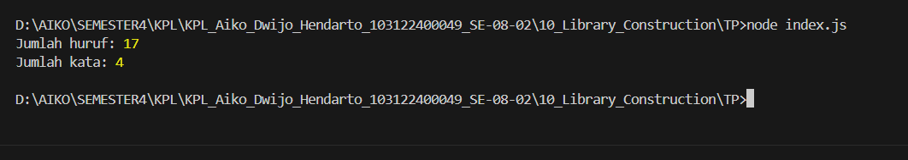

# Tugas Pendahuluan Modul 10

## Library Construction

### Identitas

* Nama : Aiko Dwijo Hendarto
* NIM : 103122400049
* Kelas : SE-08-02

---

## Deskripsi Program

Program ini dibuat untuk memenuhi tugas pendahuluan Modul 10 mengenai pembuatan pustaka (library) JavaScript menggunakan sistem module ES Module (ESM). Program memiliki dua fungsi utama yaitu menghitung jumlah huruf dan menghitung jumlah kata pada sebuah kalimat. Program hanya menghitung huruf alfabet A-Z, sedangkan spasi dan karakter selain huruf tidak dihitung.

Fungsi-fungsi tersebut ditempatkan pada file terpisah agar dapat digunakan kembali melalui proses export dan import module. Dengan pendekatan ini, kode menjadi lebih rapi, modular, dan mudah digunakan pada program lain.

---

## Struktur Program

```txt id="spbq11"
TP/
│── index.js
│── utils.js
│── package.json
```

---

## Kode Program

### utils.js

```js id="e04p4z"
export function hitungHuruf(teks) {

    return teks.replace(/[^a-zA-Z]/g, '').length;

}

export function hitungKata(teks) {

    const kata = teks.match(/[a-zA-Z]+/g);

    return kata ? kata.length : 0;

}
```

### index.js

```js id="w95m7w"
import { hitungHuruf, hitungKata } from './utils.js';

const kalimat = 'Halo Dunia Saya Aiko';

console.log('Jumlah huruf:', hitungHuruf(kalimat));
console.log('Jumlah kata:', hitungKata(kalimat));
```

### package.json

```json id="mca41q"
{
  "name": "tp_10",
  "version": "1.0.0",
  "type": "module",
  "main": "index.js"
}
```

---

## Penjelasan Tugas

Pada tugas ini dibuat sebuah pustaka JavaScript sederhana yang menyediakan fungsi untuk menghitung jumlah huruf dan jumlah kata. Fungsi dibuat di file terpisah menggunakan sistem module JavaScript agar dapat diimpor ke file utama. Program memanfaatkan fitur export dan import ES Module sehingga kode menjadi lebih terstruktur dan mudah digunakan kembali.

Fungsi `hitungHuruf()` digunakan untuk menghitung jumlah alfabet tanpa menghitung spasi maupun simbol lain, sedangkan fungsi `hitungKata()` digunakan untuk menghitung jumlah kata pada kalimat.

---

## Output Program


