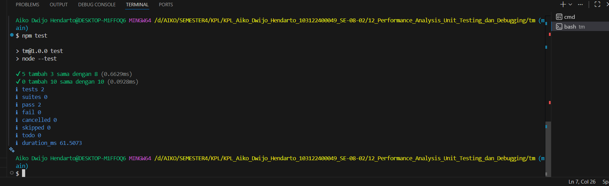

# Tugas Mandiri Modul 12
## Performance Analysis, Unit Testing, dan Debugging

### Identitas
- Nama: Aiko Dwijo Hendarto
- NIM: 103122400049
- Kelas: SE-08-02

---

## Deskripsi Program
Program dibuat untuk melakukan pengujian unit testing pada fungsi penjumlahan sederhana menggunakan Node.js bawaan (`node:test` dan `assert`).

Fungsi `tambahPengitung()` digunakan untuk menjumlahkan dua angka, kemudian dilakukan pengujian menggunakan dua test case berbeda.

---

## Hasil Pengujian
Seluruh pengujian berhasil dijalankan tanpa error.

Test yang dilakukan:
1. 5 + 3 = 8
2. 0 + 10 = 10

Semua assertion berhasil dilewati sehingga fungsi dinyatakan berjalan dengan benar.

---

## Output Program

