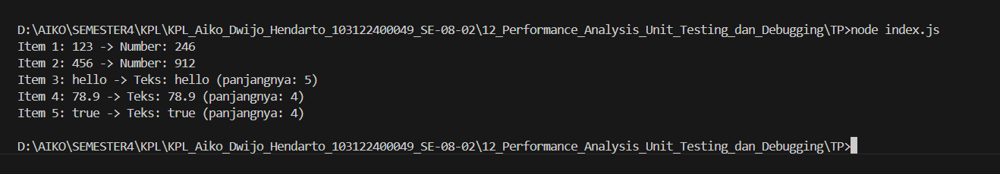

# Tugas Pendahuluan Modul 12
## Performance Analysis, Unit Testing, dan Debugging

### Identitas
- Nama: Aiko Dwijo Hendarto
- NIM: 103122400049
- Kelas: SE-08-02

---

## Deskripsi Program
Program dibuat untuk memproses berbagai tipe data seperti angka, string, dan boolean. Program akan mengecek apakah data berupa angka atau teks, lalu menampilkan hasil pemrosesan yang sesuai.

---

## Perbaikan Bug
Bug terjadi karena fungsi `.toLowerCase()` dipanggil langsung pada data yang bukan string, seperti number dan boolean. Solusi dilakukan dengan mengubah semua data menjadi string terlebih dahulu menggunakan `String(data)`.

---

## Output Program

